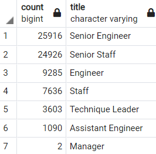
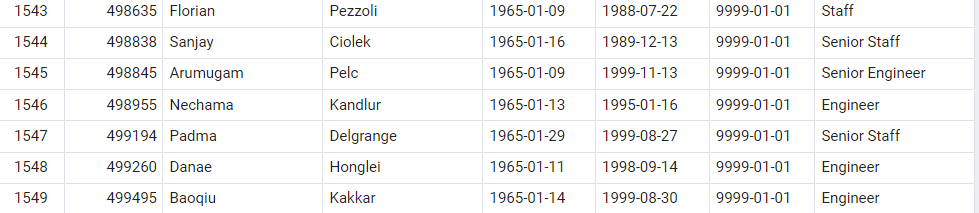
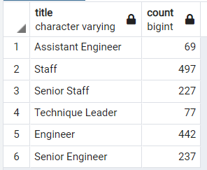

# Pewlett-Hackard-Analysis

## Overview
### Purpose
Bobby's manager is preparing for a "silver tsunami". A lot of employees are coming close to retirement age and Pewlett Hackard wants to be prepared for this.
Bobby has asked us to create a database to determine the number of retiring employees and to identify employees that are eligible to participate in a mentorship program.

## Results
- First we needed to find out how many people were close to retiring. Then we filtered out duplicates. Lastly we grouped the employees by their titles. The result was 72,458 employees were eligible for retirement.

- It is important to note that we needed to remove duplicate employees due to new roles from promotions and remove employees that are no longer with the company.

- Using the critiera from Bobby, we were able to determine who was eligible for the mentorship program. The query produced 1549 eligible candidates.

- We have a good number of eligible candidates but none of which are managers.

## Summary

It is difficult to determine how many roles will open up as people retire for different reasons and at different times.

Although only 2 managers are up for retirement, there are currently no managers in our mentorship eligibility table. Perhaps if we changed the criteria from birthdate to years with the company, we will be able to find managers for the mentorship program. Aside from this, Hewlet-Packard seems well prepared for a "silver tsunami'.

